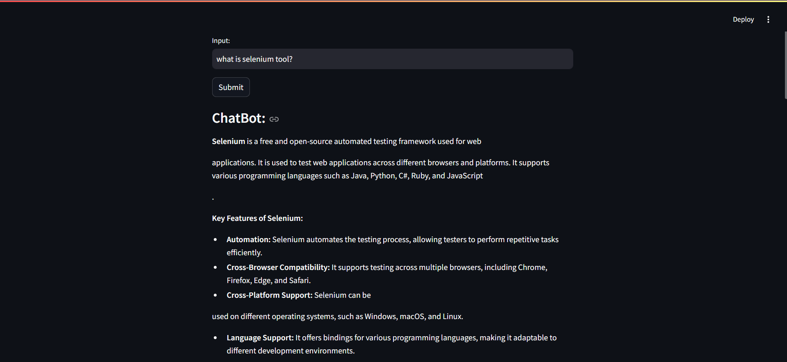

# AI ChatBot

This project is an AI-powered chatbot designed to assist users with various queries and tasks. It leverages modern AI technologies to provide intelligent and interactive conversations.

## Features
- Natural language understanding
- Context-aware responses
- Easy integration and customization

## Screenshots

### Application Interface

### Output Generation

## Getting Started
1. Clone the repository
2. Create a `.env` file with your API keys (see `.env.example` if available)
3. Install dependencies using your preferred package manager
4. Run the application 